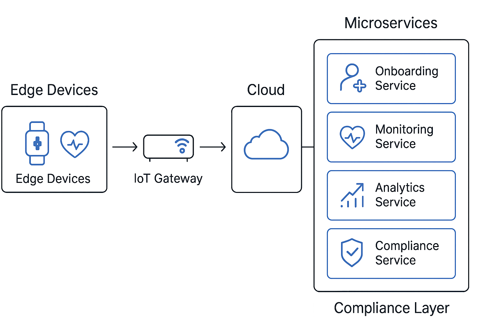

# IoT Healthcare Platform: Scalable, Secure, Patient-Centric



## 🚀 Overview
A modular IoT healthcare platform designed for **home-care monitoring**, **wellness integration**, and **pandemic-ready scalability**. Built with **FastAPI**, **edge-cloud orchestration**, and **HIPAA-compliant workflows**, this solution empowers hospitals, non-profits, and caregivers with cost-effective, secure, and patient-focused tools.

---

## ✅ Key Features
- **Modular Architecture**: Plug-and-play microservices for onboarding, monitoring, analytics, and compliance.
- **Automated Device Onboarding**: Secure Device Onboarding (SDO) with voucher-based late binding and identity federation.
- **Edge + Cloud Integration**: Fog-based IoT for low latency and cloud scalability.
- **Patient-Centric Design**: Self-service onboarding forms, transparent dashboards, and mobile-first accessibility.
- **Security & Compliance**: HIPAA/GDPR checks embedded in workflows, end-to-end encryption, hardware roots of trust.
- **Wellness Layer**: Cognitive control protocols for tinnitus and pain management, integrated with biofeedback sensors.

---

## 🛠 Tech Stack
- **Backend**: Python (FastAPI)
- **Database**: SQLite
- **Containerization**: Docker + Kubernetes (future roadmap)
- **Cloud**: AWS / Azure / GCP
- **Edge**: Raspberry Pi / Intel IoT Gateways
- **Security**: JWT, TLS, Hardware-based Trust
- **Compliance**: HIPAA/GDPR workflows

---

## 📦 Modules
- **Onboarding Service**: Automated IoT provisioning scripts.
- **Monitoring Service**: Real-time patient data from edge devices.
- **Analytics Service**: Predictive health insights.
- **Compliance Service**: Built-in HIPAA/GDPR validation.

---

## 🔗 APIs & Integrations
- Open APIs for hospitals, insurers, and non-profits.
- Community-driven extensions for collaboration.

---

## 📚 Documentation
- [Swagger UI](http://127.0.0.1:8000/docs) - Interactive API testing
- [Redoc](http://127.0.0.1:8000/redoc) - Clean API documentation

---

## ⚡ Quick Start
```bash
# Clone the repo
git clone https://github.com/your-org/iot-healthcare-platform.git

# Navigate to project
cd iot-healthcare-platform

# Install dependencies
pip install -r requirements.txt

# Start the API server (from project root)
python -m uvicorn src.IoT_healthcare_platform:app --host 127.0.0.1 --port 8000 --reload

# Access the dashboard
http://127.0.0.1:8000/docs   # Swagger UI
http://127.0.0.1:8000/redoc  # Alternative API docs
```

---

## 🖥 For Non-Technical Users
1. Install Python 3.11
2. Download this repository
3. Open PowerShell and run:
   ```powershell
   cd path\to\iot-healthcare-platform
   pip install -r requirements.txt
   python -m uvicorn src.IoT_healthcare_platform:app --reload
   ```
4. Open your browser:
   - Dashboard: http://127.0.0.1:8000/docs
   - Health check: http://127.0.0.1:8000/health

---

## ✅ Config Requirements
Ensure the `config/` folder contains:
- `config.json` with `SECRET_KEY` and `ROLES`
- `IoT_healthcare_platform_architecture.json`
- `IoT_healthcare_platform_security.json`
- `IoT_healthcare_platform_workflows.json`

---

## ✅ Logs & Database
- Logs: `logs/iot_healthcare_api.log`
- Database: `data/iot_devices.db`

---

## 🌱 Why This Project?
Unlike existing GitHub projects, this platform:
- **Empowers Non-Profits** with cost-effective deployment models.
- **Adds Cognitive Wellness** for tinnitus and pain management.
- **Includes Visual Workflow Builder** for non-technical staff.
- **Provides Pre-Built Scripts** for IoT setup and compliance checks.