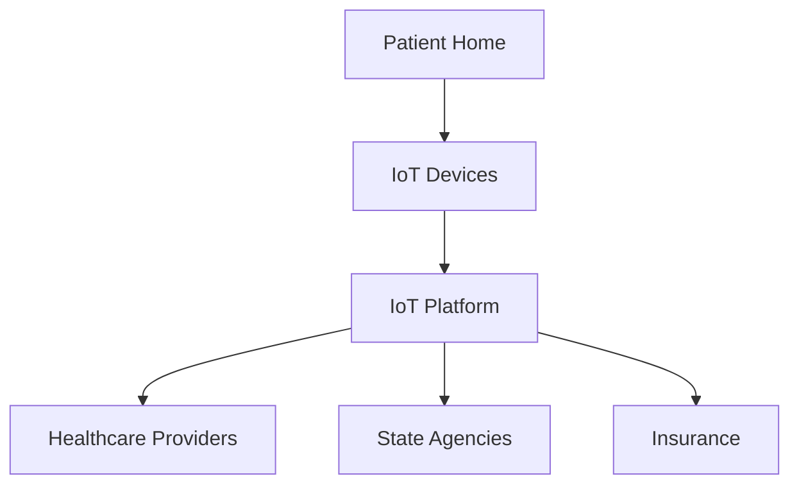
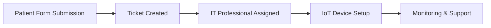
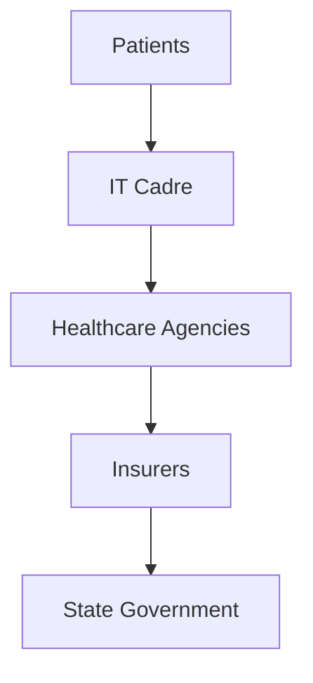

# Washington State IoT-Enabled Home-Care Initiative

## Executive Summary
Washington State faces rising healthcare costs and increasing demand for home-based care. This proposal outlines a revolutionary IoT-driven solution to empower a cadre of IT professionals to create, install, and support IoT platforms for home-care patients. The initiative will deliver cost savings, improve patient outcomes, and ensure compliance with HIPAA and other security standards.

---

## Recent Statistics (Placeholder)
- U.S. Healthcare IoT Market: **$33.04B by 2025**, CAGR **9.85%** to $48.11B by 2029.
- Global IoT in Healthcare: **$44.21B (2023)** → **$169.99B (2030)**, CAGR **21.2%**.
- Remote monitoring reduces hospital readmissions by **45%** for heart failure patients.

---

## Objectives
- Deploy IoT platforms for remote monitoring, virtual appointments, and home-care automation.
- Train and mobilize IT professionals as a home-care support network.
- Integrate cognitive wellness protocols for tinnitus and pain management using tech-assisted solutions.
- Ensure sustainability and cost-effectiveness through stakeholder collaboration and phased implementation.

---

## Key Components
### 1. IoT Infrastructure
- Smart sensors for vitals monitoring (blood pressure, glucose, heart rate).
- Secure data transmission using encrypted protocols.
- Integration with telehealth platforms for virtual appointments.

### 2. Home-Care IT Cadre
- Recruitment and training of IT professionals.
- Certification in HIPAA compliance and IoT device management.
- Deployment in regional nodes specializing in chronic conditions.

### 3. Wellness Integration
- Mobile app for cognitive control techniques:
  - Awareness training for tinnitus and pain.
  - Guided focus exercises.
  - Emergency calming toolkit.
- Optional pairing with noise-canceling headphones and biofeedback sensors.

### 4. Stakeholder Engagement
- Collaboration with state agencies, hospitals, insurers, and patient advocacy groups.
- Transparent governance and reporting.

### 5. Security & Compliance
- HIPAA-compliant data handling.
- End-to-end encryption.
- Regular audits and penetration testing.

---

## Modular Patient Onboarding System
This system uses dynamic forms to onboard patients, similar to IT ticketing but tailored for healthcare.

### Features:
- Create onboarding tickets with patient details.
- Add dynamic fields for emerging needs (e.g., pandemic response).
- Store records securely in JSON format.

Example Ticket:
```json
{
    "ticket_id": "UUID",
    "name": "John Doe",
    "age": 67,
    "condition": "Chronic Heart Failure",
    "contact_info": {"phone": "555-1234", "email": "john.doe@example.com"},
    "additional_fields": {"insurance_provider": "Medicare", "covid_vaccination_status": "Fully Vaccinated"},
    "status": "Onboarding Initiated"
}
```

---

## Mermaid Diagrams

### IoT Architecture


### Patient Onboarding Workflow


### Stakeholder Relationships


---

## Implementation Plan
### Phase 1: Pilot Program
- Select 3 counties for initial rollout.
- Deploy IoT kits and train IT professionals.
- Launch wellness app prototype.

### Phase 2: Expansion
- Scale to statewide coverage.
- Add specialized nodes for mental health, chronic pain, and elderly care.

### Phase 3: Sustainability
- Continuous improvement based on feedback.
- Integration with Medicaid and private insurance for reimbursement.

---

## Cost-Saving Impact
- Reduced ER visits through proactive monitoring.
- Lower hospitalization rates via early intervention.
- Improved patient satisfaction and compliance.

---

## Future Vision
- AI-driven predictive analytics for health trends.
- Integration with smart home ecosystems.
- Nationwide replication of the Washington model.


## Technical Readiness & Compliance Alignment

The platform demonstrates strong technical readiness:
- Built with FastAPI for scalability
- Embedded HIPAA/GDPR compliance workflows
- Secure onboarding and monitoring services

This aligns with strategic goals for patient safety, cost reduction, and interoperability.
