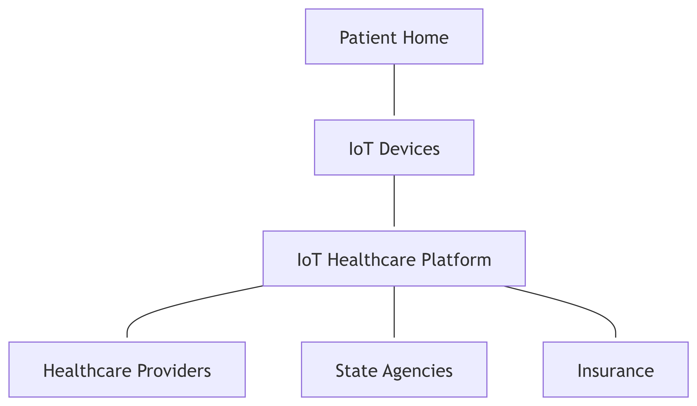
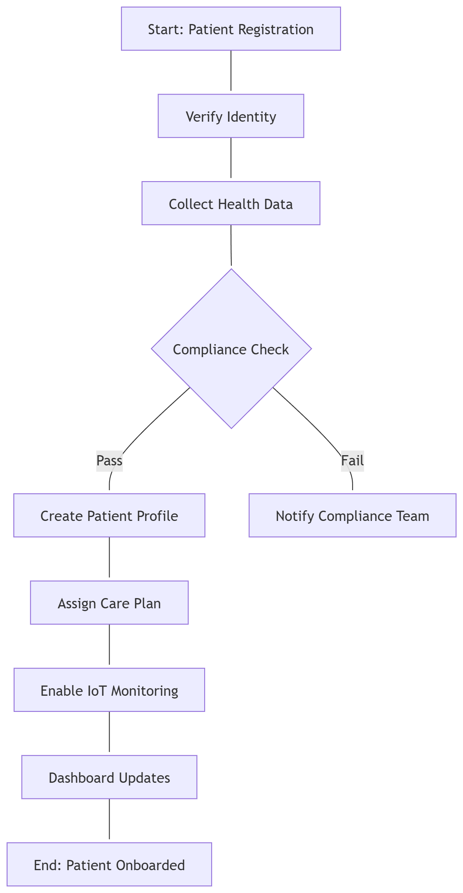

# Washington State IoT Healthcare Platform & Techno-Lodge Initiative

## Executive Summary
Washington State is advancing toward smarter, more accessible healthcare. This proposal leverages **IoT-enabled home-care** and **Techno-Lodge digital hubs** to:
- Improve patient outcomes through proactive care.
- Ensure HIPAA/GDPR compliance with automated checks.
- Create rural jobs and promote digital equity.
- Utilize **existing funding streams** (broadband grants, Medicaid telehealth reimbursements).

---

## Strategic Alignment
- **State Priorities**: Rural broadband, telehealth expansion, cost efficiency.
- **Funding Sources**: Federal broadband programs, state innovation funds, Medicaid.
- **Technical Readiness**: FastAPI backend, JWT authentication, SQLite DB, CI/CD roadmap.

---

## Demo Script (Live)
1. **Swagger UI**:
   - `/login` → Secure authentication.
   - `/compliance` → Automated HIPAA/GDPR check.
   - `/security` → Dynamic security posture.
2. **Techno-Lodge Dashboard**:
   - Rollout map (Tribal-first → Rural → Urban).
   - KPIs and funding transparency.

---

## Talking Points
- "Compliance is automated, ensuring trust and efficiency."
- "Security policies update instantly: keeping systems resilient."
- "We leverage existing funds: smart allocation for maximum impact."
- "Proactive innovation delivers better care and stronger communities."
---

## Mermaid Diagrams

### Patient Onboarding Workflow

---
## Stakeholder Relationships

## Rollout Timeline (Techno-Lodge)

